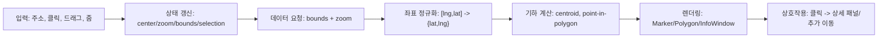
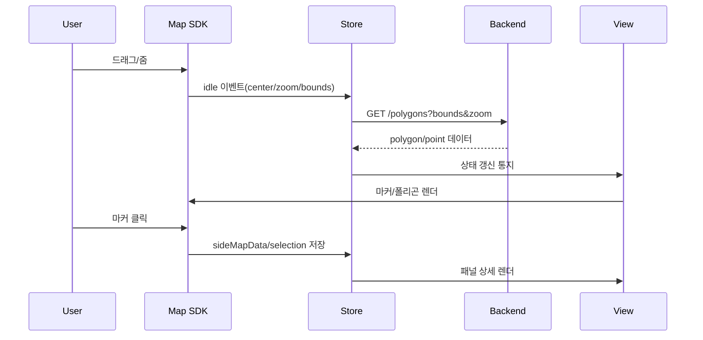

# 지도 앱 설계와 좌표/마커 배치 완전 학습 가이드

이 문서는 특정 프로젝트 코드를 몰라도, 지도 앱의 핵심 원리를 처음부터 끝까지 이해할 수 있도록 만든 학습 문서다.  
목표는 아래 3가지를 스스로 설명할 수 있게 되는 것이다.

1. 위도/경도를 받아서 지도 위 원하는 지점에 정확히 표시하는 방법
2. 폴리곤 데이터에서 대표 마커 위치를 계산하는 방법
3. 지도 앱을 실제 서비스 수준으로 설계하는 상태 관리/성능/테스트 방법

---

## 1) 지도 앱을 바라보는 기본 모델

지도 앱은 아래 파이프라인으로 동작한다.



핵심은 항상 같다.

1. 상태를 먼저 정리한다.
2. 좌표를 표준 형식으로 통일한다.
3. 계산과 렌더링을 분리한다.
4. 렌더링 기준점(anchor)을 명확히 관리한다.

---

## 2) 위도/경도와 좌표계

### 2.1 위도/경도의 의미

1. 위도(lat): 남북 위치, 범위는 -90 ~ 90
2. 경도(lng): 동서 위치, 범위는 -180 ~ 180
3. 보통 API는 `[lng, lat]` 배열을 많이 쓰고, 앱 내부는 `{lat, lng}` 객체를 많이 쓴다.

실무 규칙:

1. 외부 입력이 어떤 형식이든 내부 표준으로 변환한다.
2. 변환 함수는 프로젝트 전역에서 하나만 사용한다.

예시:

```ts
type RawCoord = [number, number]; // [lng, lat]
type Coord = { lat: number; lng: number };

function normalizeCoord(raw: RawCoord): Coord {
  return { lat: raw[1], lng: raw[0] };
}
```

### 2.2 왜 좌표계 변환이 필요한가

지도 엔진마다 내부 투영 좌표가 다르다.

1. WGS84 (EPSG:4326): 사람이 이해하기 쉬운 위도/경도
2. Web Mercator (EPSG:3857): 타일 렌더링에 적합한 평면 좌표

많은 엔진은 내부적으로 3857을 쓰고, API는 4326을 받거나 둘 다 지원한다.

### 2.3 4326 <-> 3857 핵심 식

반지름 `R = 6378137`

4326 -> 3857

1. `x = R * lng * pi / 180`
2. `y = R * ln(tan(pi/4 + lat*pi/360))`

3857 -> 4326

1. `lng = x / R * 180 / pi`
2. `lat = (2 * atan(exp(y / R)) - pi/2) * 180 / pi`

주의:

1. Mercator 유효 위도는 약 `-85.05112878 ~ 85.05112878`이다.
2. 극지방 근처에서는 왜곡이 커진다.

---

## 3) 지도 상태(State) 설계

좋은 지도 앱은 상태가 명확하다. 최소 상태는 아래 정도가 필요하다.

```ts
type MapState = {
  center: { lat: number; lng: number };
  zoom: number;
  bounds: { neLat: number; neLng: number; swLat: number; swLng: number } | null;
  polygons: PolygonData[];
  markers: MarkerData[];
  selected: Selection | null;
  pendingMapMove: { lat: number; lng: number; zoom?: number } | null;
  ui: {
    activeCategory: "land" | "apt" | "officetel" | "building" | "auction" | "development" | "ai" | "analysis";
    isAreaMeasureMode: boolean;
  };
};
```

운영 규칙:

1. 지도 이벤트(idle/drag/zoom) -> `center/zoom/bounds` 갱신
2. `bounds + zoom` 변경 -> 데이터 재요청
3. 렌더는 상태를 읽기만 하고, 직접 비즈니스 판단을 최소화

---

## 4) 이벤트 흐름(실시간 동작)



핵심 포인트:

1. 지도는 "상태 입력 장치"
2. 스토어는 "단일 진실 소스"
3. 뷰는 "상태의 결과물"

---

## 5) 폴리곤에서 마커 위치 계산하기

폴리곤 대표점은 보통 아래 순서로 계산한다.

1. 중심점(centroid) 계산
2. centroid가 폴리곤 내부인지 검사
3. 내부가 아니면 내부 대표점으로 보정

### 5.1 Shoelace centroid

정점 `P_i = (x_i, y_i)`에서 `x=lng`, `y=lat`로 둔다.

1. `A = 1/2 * Σ(x_i*y_{i+1} - x_{i+1}*y_i)`
2. `Cx = 1/(6A) * Σ((x_i + x_{i+1}) * Δ_i)`
3. `Cy = 1/(6A) * Σ((y_i + y_{i+1}) * Δ_i)`
4. `Δ_i = x_i*y_{i+1} - x_{i+1}*y_i`

의사코드:

```ts
function centroidShoelace(ring: Array<{lng:number; lat:number}>) {
  let twiceArea = 0;
  let cx = 0;
  let cy = 0;
  const n = ring.length;

  for (let i = 0, j = n - 1; i < n; j = i++) {
    const xi = ring[i].lng, yi = ring[i].lat;
    const xj = ring[j].lng, yj = ring[j].lat;
    const term = xi * yj - xj * yi;
    twiceArea += term;
    cx += (xi + xj) * term;
    cy += (yi + yj) * term;
  }

  if (twiceArea === 0) return null; // 퇴화 다각형
  const area = twiceArea / 2;
  return { lng: cx / (6 * area), lat: cy / (6 * area) };
}
```

### 5.2 Point-in-Polygon (Ray Casting)

centroid가 내부인지 확인할 때 자주 쓰는 방식이다.

의사코드:

```ts
function isPointInPolygon(p, polygon) {
  let inside = false;
  for (let i = 0, j = polygon.length - 1; i < polygon.length; j = i++) {
    const xi = polygon[i].lng, yi = polygon[i].lat;
    const xj = polygon[j].lng, yj = polygon[j].lat;
    const intersect =
      (yi > p.lat) !== (yj > p.lat) &&
      p.lng < ((xj - xi) * (p.lat - yi)) / (yj - yi) + xi;
    if (intersect) inside = !inside;
  }
  return inside;
}
```

### 5.3 centroid가 바깥이면 어떻게 보정하나

오목(concave) 다각형에서는 centroid가 밖으로 나갈 수 있다.  
대표 보정 전략:

1. Bounding Box 안을 격자로 샘플링
2. 내부 점만 후보로 선택
3. 각 후보의 "경계까지 최소 거리"를 계산
4. 최소 거리가 가장 큰 점을 대표점으로 선택

이 방식은 "눈에 보기 좋은 내부 중심점"을 준다.

---

## 6) 마커가 실제 위치와 어긋나는 이유

위경도 계산이 맞아도, 화면에서는 어긋날 수 있다.  
원인은 대부분 `anchor`다.

### 6.1 anchor의 의미

`anchor`는 "아이콘의 어떤 픽셀이 좌표점에 붙는가"를 정한다.

예:

1. `(0,0)`이면 아이콘 좌상단이 좌표점에 붙는다.
2. `(w/2,h)`이면 아이콘 하단 중앙이 좌표점에 붙는다.

### 6.2 자주 나는 버그

1. 마커 HTML 폭/높이는 가변인데 anchor는 고정값
2. 결과: 좌하단 또는 우하단으로 치우쳐 보임

### 6.3 안전한 정렬 패턴

패턴 A:

1. `anchor = (0,0)` 고정
2. HTML wrapper에 `transform: translate(-50%, -100%)` 적용
3. 좌표점을 "말풍선 꼬리 끝"으로 일관 정의

패턴 B:

1. 렌더 후 실제 DOM 크기 측정
2. 측정값 기반 동적 anchor 적용

패턴 A가 단순하고 유지보수성이 높다.

---

## 7) 주소 검색부터 상세 패널까지 연결하는 방법

주소 검색 플로우:

1. 검색어 입력
2. Geocoding API 호출 -> `{lat,lng}` 획득
3. 지도 center 이동
4. 해당 좌표의 상세 폴리곤 조회
5. `sideMapData`에 `properties`, `paths`, `clickPosition` 저장
6. 패널은 `sideMapData`만 구독해서 상세 렌더

중요:

1. 패널이 지도를 직접 제어하지 말고 `pendingMapMove` 같은 명령 상태를 통해 요청
2. 지도 컴포넌트가 이 명령을 처리하고 완료 후 clear

---

## 8) 줌/Bounds 기반 데이터 전략

한 화면에서 모든 디테일을 그리면 느려진다.  
줌 레벨별 데이터 밀도를 나눈다.

예시 전략:

1. `zoom < 11`: 요청하지 않음
2. `11 <= zoom <= 13`: 구 단위 집계
3. `14 <= zoom <= 16`: 동 단위 집계
4. `zoom >= 17`: 개별 필지/개별 거래

요청 키는 항상 `bounds + zoom`이다.

---

## 9) 성능 설계 핵심

### 9.1 마커 풀링

1. 마커를 삭제하지 말고 풀에 반환
2. 새 렌더 시 재사용
3. 객체 생성/GC 비용 감소

### 9.2 뷰포트 필터링

1. bounds 밖 마커는 생성하지 않음
2. 표시 중 마커도 bounds 밖이면 숨기거나 풀로 반환

### 9.3 리렌더 억제

1. 같은 `sideMapData`는 무시
2. 카테고리 변경 시에만 마커 재생성
3. 단순 스타일 토글은 `setVisible`로 처리

---

## 10) 안정성 설계 (실무에서 꼭 필요)

1. 좌표 형식 방어 코드를 넣는다.
- `LatLng 객체`, `{lat,lng}`, `{x,y}`, `[lng,lat]` 모두 수용 후 표준화.

2. 잘못된 다각형을 방어한다.
- 점 3개 미만, area=0, NaN 좌표 처리.

3. 비동기 중복 요청을 제어한다.
- 같은 bounds/zoom 요청 dedupe.
- 이전 요청 취소 또는 최신 응답만 반영.

4. 지도 이벤트 폭주를 제어한다.
- `idle` 중심으로 처리.
- 필요 시 debounce/throttle.

---

## 11) 테스트 전략

### 11.1 단위 테스트

1. `normalizeCoord` 입력 형식별 테스트
2. `centroidShoelace` 정사각형/직사각형/오목 다각형 테스트
3. `isPointInPolygon` 경계값 테스트
4. `lat/lng <-> mercator` 역변환 오차 허용 범위 테스트

### 11.2 통합 테스트

1. 드래그 -> bounds 갱신 -> fetch 호출 파이프라인
2. 검색 -> center 이동 -> 상세 패널 표시
3. 패널 이동 요청 -> pendingMapMove 처리

### 11.3 시각 회귀 테스트

1. 기준 좌표에서 마커 꼬리 픽셀이 정확히 지점에 붙는지 스냅샷
2. 줌 레벨별 마커 밀도 스냅샷

---

## 12) 새 프로젝트에 적용할 권장 구조

```txt
src/
  domain/
    geo/
      normalize.ts
      projection.ts
      centroid.ts
      pointInPolygon.ts
  state/
    mapStore.ts
  adapters/
    map/
      naverAdapter.ts
      kakaoAdapter.ts
      mapboxAdapter.ts
  features/
    map/
      controller.ts
      renderers/
        markerRenderer.ts
        polygonRenderer.ts
      ui/
        MapView.tsx
        SearchPanel.tsx
```

규칙:

1. Domain(계산)과 Adapter(SDK 의존)를 분리한다.
2. SDK 객체는 Adapter 밖으로 새지 않게 한다.
3. UI는 상태와 이벤트만 다룬다.

---

## 13) 실전 체크리스트

배포 전에 아래를 반드시 확인한다.

1. 좌표 표준이 문서화되어 있는가
2. 외부 좌표 형식에 대한 정규화 함수가 단일화되어 있는가
3. centroid가 폴리곤 밖일 때 fallback이 있는가
4. anchor 기준점이 디자인 규격과 일치하는가
5. bounds/zoom 기반 요청이 중복 없이 동작하는가
6. 대량 마커에서 프레임 드랍이 없는가
7. 지도 이벤트 해제(cleanup)가 누락되지 않았는가
8. 클릭 위치(`clickPosition`)와 시각 위치가 일치하는가

---

## 14) 자주 헷갈리는 개념 정리

1. BBox 중심과 centroid는 다르다.
- BBox 중심은 사각형 중심
- centroid는 다각형 면적 중심

2. 좌표가 맞아도 화면 위치가 틀릴 수 있다.
- anchor/transform 문제일 가능성이 크다.

3. 지도 SDK별 줌 기준이 다를 수 있다.
- 카카오는 level 역방향 매핑을 쓰는 경우가 많다.

4. 경도/위도 순서를 한 번이라도 뒤집으면 전체가 무너진다.
- normalize 단계 강제 + 테스트 필수

---

## 15) 7일 학습 로드맵

1일차:
1. 위도/경도, 좌표계(4326/3857) 이해
2. 변환식 손으로 계산

2일차:
1. 지도 이벤트 흐름(idle, click, zoom) 설계
2. 상태 모델 설계

3일차:
1. centroid, point-in-polygon 구현
2. 오목 다각형 fallback 구현

4일차:
1. 마커 렌더러 구현
2. anchor/transform 정렬 실습

5일차:
1. bounds+zoom API 전략 구현
2. 카테고리별 렌더 분기 구현

6일차:
1. 성능 최적화(풀링, 필터링)
2. 이벤트 누수 점검

7일차:
1. 단위/통합/시각 테스트 작성
2. 체크리스트로 최종 검증

---

## 16) 최종 요약

좋은 지도 앱은 아래 4가지가 동시에 맞아야 한다.

1. 좌표 표준화
2. 기하 계산 정확성
3. 렌더 기준점(anchor) 일관성
4. 이벤트-상태-렌더 단방향 구조

이 4개를 지키면, "위경도를 받아 원하는 위치에 정확히 표시"하는 문제는 안정적으로 해결할 수 있다.

